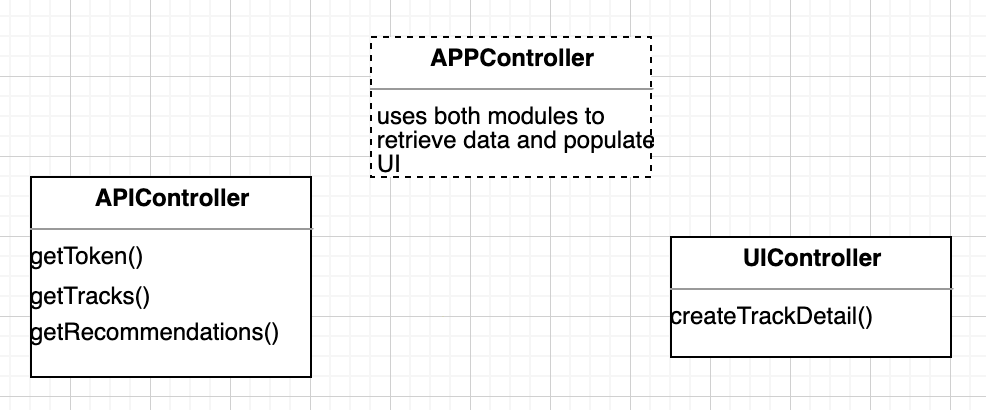

## Overview

Login to Spotify's developer dashboard [here](https://developer.spotify.com/dashboard/login). Then press **create an app**. Give it a cool name and press **Create**!

Click into your app and record the **Client Id** and **Client Secret**. 


Before the actual programming, here's a quick overview of how the project is structured. We're going to be using the **module pattern** in javascript, which kind of mimicks **classes** in OOP languages like Java. Kind of. 

**Basics:**

- allows encapsulation and separation of private/public variables and methods
- better organization and separation of concerns
- implemented with Closures and IIFEs


Let's take a look at an example:

```js
const car = (function(){
  var speed = 100;
  return {
  	forward() {
      speed += 1;
    }
	}
})();
```

The variable speed is available only within the scope of the function, so it can't be accessed from the outside environment. However, it can be changed through the use of a **Closure**. A Closure in Javascript is an inner function that has access to the variables of its outer function. In this case, our outer function is returning the function `forward`,  which allows us to change the value of private variable `speed`  without allowing us direct access. 


Watch [this](https://egghead.io/lessons/javascript-the-module-pattern-in-javascript-aka-immediately-invoked-function-expression-aka-iife#:~:text=Search%20Catalog-,The%20Module%20Pattern%20in%20Javascript%20(aka%20Immediately,Invoked%20Function%20Expression%20aka%20IIFE)&text=Javascript%20modules%20are%20a%20design,into%20smaller%20self%20managing%20pieces.) video to see an example of using the module pattern to make a calculator.


Also notice that the function declaration is surrounded by parentheses, with another pair at the end of the declaration. This makes the function an IIFE, or **Immediately-invoked Function Expression**. IIFEs are that defined as expressions and executed immediately after creation. The first pair of parentheses, which wrap the function, indicate an expression. In Javascript, expressions evaluate to a single value, which in this case is our actual function. To call the function immediately, we add the second pair of parentheses `();`,  like how you would call an normal function. 


Anything declared in an IIFE is not visible to the global scope, meaning that something like the `forward`  function we returned can only be accessed through the const `car`.  This practice allows us to contain all relevant methods to `car`  within in its own scope and also avoid polluting the global scope with variables that are only being used in one place. Read [this](https://medium.com/@vvkchandra/essential-javascript-mastering-immediately-invoked-function-expressions-67791338ddc6) article for more detail.


In this project, we're going to have two separate modules that handle distinct concerns– one called `APIController`for handling API calls and the other called `UIController `for handling our HTML input fields.  A third module, called `APPController`,  will handle the actually retrieving and displaying the data. Each module will have public methods that the `APPController`  will call.




To get started, create a new js file called `Song.js` . I've already declared `APPController`  for you. Finish writing the function expressions for `APIController`  and `UIController`. 

```js
//look at the above example and the APPController declaration for syntax
//both API and UI modules take in no parameters

//spotify api call
const APIController = ??

// UI Module
const UIController = ??

  
const APPController = (function(UICtrl, APICtrl) {

})(UIController, APIController);

```

